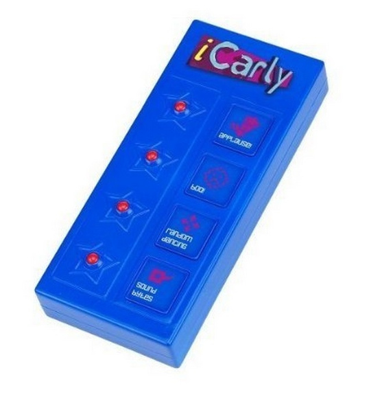
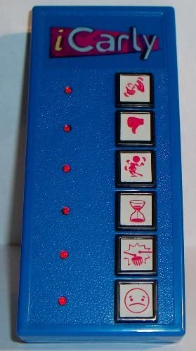

# Week 1 

Presentatie met groepje over selectoren: 
https://codepen.io/farrahton/pen/xxPqNrV 

Ik heb gekozen voor de control panel opdracht. In de eerste instantie wilde ik een Nintendo DS, Nintendo Switch of GameBoy maken met knoppen die je kan gebruiken. Uiteindelijk heb ik toch gekozen voor een remote control van de personage Sam uit de Nickelodeon TV-show iCarly. Aangezien dit nog niet per se online bestaat en ik graag originele/niet veel voorkomende dingen maak. Met deze keuze kan ik mij focussen op het coderen van 4 interacties en het coderen in plaats het bedenken van een stuk of 10 interacties. 

Eigenlijk is dit vak in zijn geheel een uitdaging. Ik heb namelijk zo goed als geen ervaring in zowel HTML en CSS. Ik kijk vooral uit naar het leren animeren, interacties maken en het leren omgaan met selectoren.

Ik ga aan de slag met input checkboxes als buttons, omdat ik verschillende opties tegelijk aan wil kunnen zetten. Dingen positioneren vind ik ook erg intimiderend, dus dat wordt zeker een uitdaging.

- <strong> Schets(en) van mijn ontwerp </strong>
 
 

Het wordt een mix van de twee verschillende foto's.

# Week 2 & 3

- <strong> Remote controle & positioneren </strong>
Ik ben begonnen met het maken van de remote control. In de eerste instantie wilde ik beginnen met divs voor de knopjes, maar nadat ik bij WAFS een ul had gebruikt, vond ik dit ook een handige benadering. Vooral na het leren van de term semantisch HTMl.

Waar ik wel tegenaan liep was - zoals verwacht - het positioneren van de li's. Ze kwamen niet op de volgorde die ik wilde. Wat bleek, ik hoefde alleen flex-direction: row-reverse; te gebruiken om de plek van de red light en plek van de button om te draaien in de twee kolommen. 

- <strong> Geluid met pure CSS </strong>
In de iCarly show wordt de controller vooral vaak gebruikt voor een stem die Random Dancing zegt en disco lampjes. Dit wilde ik ook toepassen in mijn control panel. Er is een 'illegale' manier om geluid af te spelen met alleen CSS. Dit heb ik geprobeerd te doen, maar op de manier waarop ik het wilde toepassen, lukte het niet. Ik dacht namelijk de video met opacity 0 te plaatsen over de knop, zodat je er op klikt en dan de video afspeelt. Helaas was dit een mislukte poging, want daardoor werkten de states van de button (hover, focus) dan niet meer en kon ik met dezelfde knop nog een andere animatie activeren. 

- <strong> Vuur keyframe </strong>
Voor een vuur animatie die ik op basis van de terugkerende grap in de iCarly show dat Spencer van alles per ongeluk in vuur steekt, vond ik het maken van een subjectief mooie vlam lastig.

Er zijn verschillende wegen naar Rome en de weg die ik mooi vond was niet passend bij dit vak: een svg path. Daarom heb ik het met border radius gedaan.

Waar ik wel tegenaan loop is in de media query grootte de vlammen ook kleiner te krijgen. Om de een of andere reden lukt dit niet op de manier die ik wil. Het maakt niet uit welk eenheid ik gebruikt vh/vw, em, rem, percentage, pixels werken allemaal niet. Met de huidige benadering is de vlam nu een beetje schuin. Iets waar ik niet heel tevreden mee ben.

- <strong> Gibby fall, hammer throw & Random Dancing </strong>
Hier heb ik met ::before gewerkt en hoe dit heel handig kan zijn voor tekeningen of vormpjes die moeten overlappen.

Ik had het al voor een eerder experiment geprobeerd, namelijk een hele simpele 'disco bal'. Gewoon een circle met een linear gradient en een straal met de discolichten in plaats van zoals het nu over het hele scherm is geworden. Alleen vond ik de bal niet zo mooi, waardoor ik het geschrapt heb en het maar over de hele foto heb gedaan. 

Een link naar dit experiment: https://codepen.io/farrahton/pen/eYeqGMx 

Tot nu toe brandde het lampje als je op de knop drukte. Dit had als effect dat de opacity van 0 naar 1 ging. Voor de disco lights heb ik echter al een opacity styling nodig, zodat je niet alleen de kleuren ziet. Daarom staat random dancing by default wel al aan. Alsnog werkte de opacity niet. Tijdens het gastcollege van Bram Strum ging het heel even over !important. Ik ging dit proberen toe te passen en met heel veel mazzel werkte dit wel.

- <strong> Responsive Design </strong>
Zoals ik aan het begin al zei, vind ik dingen op de juist plek positioneren erg uitdagend. Daarom was een responsive design niet in mijn gedachten, totdat Sanne hierover begon. Ik ging eerst uitzoeken wat de term media query is en hoe je het gebruikt om een responsive design te maken. Ik dacht een klein begin te hebben gemaakt hierin, maar miste nog veel dingen. Aangezien Sanne heel lief tijd aan mij heeft besteed door mij hiermee te helpen, heb ik veel nieuwe inzichten gekregen:

  - Een media query gebruiken voor responsiveness hoeft niet veel code te bevatten
  - Werk zoveel mogelijk met procenten
  - Gebruikt bij @media een max-width ipv de specifieke width van een iPhone of iets dergelijks
  - Aspect-ratio, flex-shrink
  - Hoe je je code kan ordenen en kan inkorten
  - Inspecteer element is je beste vriend 

# Week 4 

In de eerste weken had ik een afbeelding van de studio gebruikt, maar met de cartoon-ish animaties vond ik dit niet meer mooi. Daarom heb ik een cartoon versie gebruikt.

- Gibby valt
- Hamer animatie 
- Alle animaties goed positioneren 
- Code opschonen
De manier waarop ik in de eerste 2 weken code schreef is nu al anders ten opzichte van mijn huidige manier. In deze laatste week merkte ik al dat ik heel veel dubbele, nutteloze of te lange code had. 

- <strong> Wat ik nog zou willen toepassen</strong>

Als ik nog tijd had zou ik graag nog een extra button maken om het plaatje van de studio naar een andere kamer te veranderen en daarmee ook andere animatie opties te geven op de buttons. Ook deze animatie zouden naar iconische momenten van de show refereren, zoals een botersok, gummy bear lamp, robot van plastic flesjes, een kuikentje die langs loopt etc. Maar aangezien deze dingen opzichzelfstaand al een uitdaging zijn om in CSS te tekenen zijn deze nu niet gekozen. Voor het kuikentje zou het mij ook leuk lijken om de themasessie cursor volgen toe te passen, zodat de gebruiker het kuikentje moet zoeken net als Waar is Waldo.

Ohja en volgens mij zit er een bug in mijn code, want soms laadt het niet de donkerste oranjes van de vlammen. Pas na de pagina refreshen en weer op de knop ervoor te klikken komt het goed in beeld. 

-<strong> Wat ik ga meenemen</strong>
In principe alles, want ik heb door dit vak een hele nieuwe taal geleerd. Ik merkte vaak genoeg al dat ik de specifieke selectoren ook wilde gebruiken voor WAFS, terwijl ik daar wel classes en ID's mocht gebruiken. De kans is dus groot dat ik de kracht van specifieke selectoren veel ga toepassen in de toekomst. Verder wil ik de subtielere animaties en andere mogelijkheden in CSS die in alledaagse websites voorkomen nog eens uitproberen. Er waren een paar in de themasessies voorgekomen, maar die waren niet per se relevant voor mijn control panel.

Heel snel nog in het kort:
- Soepeler dan verwacht ging het überhaupt oppikken van coderen.
- Het lastigste vind ik responsive positioneren en het zoeken van wat ik nou in gedachten heb. Vaak weet ik de exacte codeer termen niet waarmee ik de juiste zoekresultaten zou krijgen.
- Ik ben ontzettend trots op het feit dat ik in zo kort tijd enorme stappen heb gezet voor mijn gevoel. Voorafgaan de minor kon ik alleen kleurtjes veranderen en verder niets. Deze kleurtjes kwamen toen ook niet eens op de elementen waarop ik ze wilde hebben, omdat ik nog niets wist over de specifieke selectoren. Animaties leek toen magie die alleen gevorderden en experts bezitten, maar nu kan ik het ook een beetje.

# Bronnen

Veel uit de themasessies gehaald en de met hulp/inzichten van docenten, gastcolleges en klasgenoten.  Verder heb ik voor de vlammen dit voorbeeld gebruikt op codepen.io: https://codepen.io/dazulu/details/nPeEeG 
